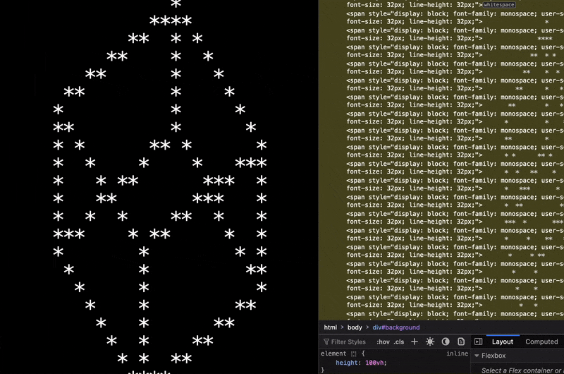

# ASCII Engine

An ASCII-based renderer for creating animations directly in the browser. ASCII Engine allows for dynamic, grid-based animations displayed as text, providing a unique, retro feel. This package is still under development.

The library utilizes DOM to render characters on the screen.



## Installation

You can install ASCII Engine via npm:

```bash
npm install ascii-engine
```

or use the script directly in your HTML:

```
https://ozencb.github.io/ascii-engine/latest/ascii-engine.js
```

## Usage

Create a placeholder container element with an id of your choice, and pass this element down to the render's function first parameter. For the second parameter, pass an animation function.

The container element should ideally have a height of 100vh.

### Using a Script Tag

Include the ASCII Engine script in your HTML file and call the `render` function:

```html
<!DOCTYPE html>
<html lang="en">
  <head>
    <meta charset="UTF-8" />
    <meta name="viewport" content="width=device-width, initial-scale=1.0" />
    <title>Document</title>
    <script src="https://ozencb.github.io/ascii-engine/latest/ascii-engine.js"></script>
  </head>

  <body style="background-color: black; color: white">
    <div id="background" style="height: 100vh"></div>
    <script>
      const density = [' ', '░', '▒', '▓', '█'];
      const animation = () => {
        return density[Math.floor(Math.random() * density.length)];
      };

      AsciiEngine.render(document.getElementById('background'), animation);
    </script>
  </body>
</html>
```

### Using ES Modules

Import the `render` function from the ASCII Engine package and use it in your JavaScript code:

```typescript
import { render } from 'ascii-engine';

const density = [' ', '░', '▒', '▓', '█'];
const animation = () => {
  return density[Math.floor(Math.random() * density.length)];
};

render(document.getElementById('background'), animation);
```

## Example Animation Module

Here is a simple example of an animation module you can use with ASCII Engine:

```javascript
export const CheckerBoard: Animation = (coords, context, buffer, cursor) => {
  // create a static checkboard pattern
  return (coords.x + coords.y) % 2 === 0 ? '█' : ' ';
};
```

## API

### Renderer

`render(target: HTMLElement, animation: Animation, options?: RenderOptions): void`

Renders the ASCII animation on the specified target element.

- `target`: The HTML element where the animation will be rendered.
- `animation`: The animation module containing the `main` function.
- `options`: Optional rendering options.
  - `resolution`: Controls the size of each character cell. Accepts numbers between `1 to 10` or `Resolution` enum values (TypeScript only).

### Animation Module

An animation module should have the following structure:

```typescript
// anim.ts
export const CheckerBoard: Animation = (coord: Coordinates, context: AnimationContext, buffer: FrameBuffer, cursor: CursorContext): string | null => {
  // do stuff and return back a character 
};
```


#### Parameters
- `coords`: The coordinates of the current cell.
    - `x`: (number) Column index
    - `y`: (number) Row index
- `context`: The animation context, providing cell metrics and frame information.
    - `frame`: (number) Current frame count
    - `deltaTime`: (number) Time in seconds since the last frame
    - `elapsedTime`: (number) Total elapsed time in seconds
    - `cellWidth`, cellHeight: (number) Dimensions of each cell
    - `rows`: (number) Grid dimensions
    - `cols`: (number) Grid dimensions
- `buffer`: (string[][]) The frame buffer, allowing direct mutation of the grid.
- `cursor`: The cursor’s position and state, including:
    - `x`: (number) Cursor coordinates in pixels
    - `y`: (number) Cursor coordinates in pixels
    - `col`: (number) Cursor location in grid cells
    - `row`: (number) Cursor location in grid cells
    - `pressed`: (boolean) Whether the cursor button is pressed

Please check demo animations under `src/demo` for different use cases for these parameters.

## Development

You can simply clone the repo and then use `yarn` to install dependencies, and then `yarn build` to build the project. You can then use the `index.html` for demo and development purposes.


## ToDo

- [ ] Colored characters
- [ ] Pre and post render functions

## License

This project is licensed under the GNU Public License.